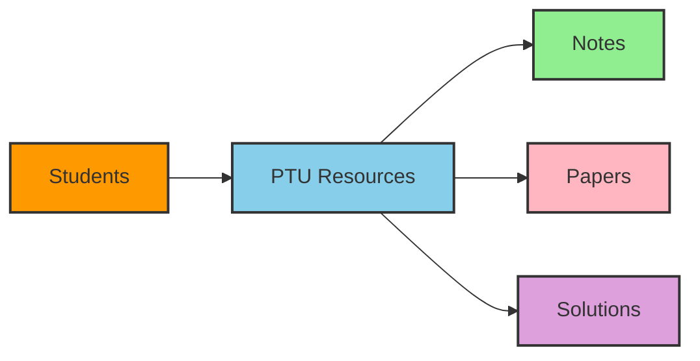

<div align="center">
  

  

# 📚 IKG Punjab Technical University Resources

<div aligm="center">
  
</div>

## 🔗 Official Links
- [PTU Official Website](https://ptu.ac.in/)
- [PTU Examination Portal](https://www.ptuexam.com)

## Quick Links

[![Documentation][docs-shield]][docs-url]
[![Issues][issues-shield]][issues-url]
[![Pull Requests][pr-shield]][pr-url]
[![Wiki][wiki-shield]][wiki-url]

[docs-shield]: https://img.shields.io/badge/docs-PTU_Docs-blue.svg?style=for-the-badge
[docs-url]: https://github.com/Drago-03/PTU/wiki/Documentation
[issues-shield]: https://img.shields.io/github/issues/Drago-03/PTU?style=for-the-badge
[issues-url]: https://github.com/Drago-03/PTU/issues
[pr-shield]: https://img.shields.io/github/issues-pr/Drago-03/PTU?style=for-the-badge
[pr-url]: https://github.com/Drago-03/PTU/pulls
[wiki-shield]: https://img.shields.io/badge/wiki-PTU_Wiki-green.svg?style=for-the-badge
[wiki-url]: https://github.com/Drago-03/PTU/wiki

[](https://github.com/Drago-03/PTU/stargazers)
[](https://github.com/Drago-03/PTU/network)
[](https://github.com/Drago-03/PTU)

| [📖 Documentation](https://github.com/Drago-03/PTU/wiki/Documentation) | [🐛 Report Bug](https://github.com/Drago-03/PTU/issues/new?template=bug_report.md) | [✨ Request Feature](https://github.com/Drago-03/PTU/issues/new?template=feature_request.md) | [📚 Wiki Home](https://github.com/Drago-03/PTU/wiki) | [📋 Issue Templates](https://github.com/Drago-03/PTU/issues/new/choose) |
|---|---|---|---|---|

</div>


## 🎯 About The Project

<div align="center">
  


</div>

This repository serves as a centralized resource hub for IKG Punjab Technical University students, offering a carefully curated collection of study materials, previous year papers, and comprehensive notes.


## 📑 Repository Contents

<div align="center">

| Resource Type | Description | Status |
|--------------|-------------|---------|
| 📓 Class Notes | Detailed subject-wise notes | [](/) |
| 📝 Question Papers | Previous year papers | [](/) |
| ✅ Solutions | Solved answers | [](/) |
| 📚 Study Materials | Additional resources | [](/) |

</div>


## 📁 Directory Structure

<details>
<summary>Click to expand!</summary>

```bash
PTU/
├── Semester-1/
│   ├── Notes/           # 📚 Class notes and study materials
│   ├── Question-Papers/ # 📝 Previous year papers
│   └── Solutions/       # ✅ Solved answers
├── Semester-2/
│   ├── Notes/
│   ├── Question-Papers/
│   └── Solutions/
[...and so on]
```

</details>

<div align="center">
  
</div>

## 🔄 Latest Updates
<div align="center">
   
| Date | Update |
|------|---------|
| Currently | Adding new study materials |
| Weekly | Question paper updates |
| Monthly | Solutions and notes update |
| Semester | Major content revision |

</div>

## 📥 Quick Start

```bash
# Clone the repository
git clone https://github.com/Drago-03/PTU.git

# Navigate to the directory
cd PTU

# Start exploring!
```


## 🤝 Contributing

<div align="center">
  
</div>

## 📞 Contact & Support

<div align="center">

### 👥 Author & Maintainer
[](https://github.com/Drago-03)
[](https://github.com/Drago-03)

### 📫 Connect With Me
[](mailto:mantejarora@gmail.com)
[](https://github.com/Drago-03)
[](https://www.linkedin.com/in/mantej-singh-a-724219288/)

### 📄 Project Links
[](https://github.com/Drago-03/PTU/wiki)
[](https://github.com/Drago-03/PTU/issues)
[](https://github.com/Drago-03/PTU/discussions)

</div>

## 📚 Documentation & Resources

- [📖 Full Documentation](https://github.com/Drago-03/PTU/wiki/Documentation)
- [🚀 Getting Started Guide](https://github.com/Drago-03/PTU/wiki/Getting-Started)
- [📋 Contributing Guidelines](https://github.com/Drago-03/PTU/wiki/Contributing)
- [❓ FAQ](https://github.com/Drago-03/PTU/wiki/FAQ)
- [🔍 Search Wiki](https://github.com/Drago-03/PTU/search?type=wikis)

## 🔖 Quick Access

<details>
<summary>📑 Issue Templates</summary>

- [🐛 Bug Report](https://github.com/Drago-03/PTU/issues/new?template=bug_report.md)
- [✨ Feature Request](https://github.com/Drago-03/PTU/issues/new?template=feature_request.md)
- [📝 Documentation Update](https://github.com/Drago-03/PTU/issues/new?template=documentation.md)
- [❓ Question](https://github.com/Drago-03/PTU/issues/new?template=question.md)

</details>


<div align="center">
  
  
  <sub>⭐ Star this repo if it helped you!</sub>
</div>
